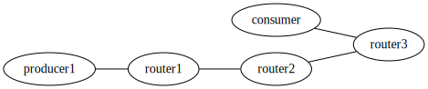

# NDN Network Generator

NDN Network を CSV に設定を書くだけで自動的に構築します。

ノードの設定、NLSR の設定、face を貼るところまで全て自動で行います。

また、NDN-FCW+の環境も構築できます。


## 使い方

1. 依存関係のインストール
1. `config/network_relations.csv` にネットワークのつながりを記述
1. `config/node_info.csv` にそれぞれのノード起動時のコマンドを記述
1. 起動
1. リクエストする


### 1. 依存関係のインストール

```
pip install -r requirements.txt
```

### 2. `config/network_relations.csv` にネットワークのつながりを記述

`network_relations.csv` にはノード間のつながりを記述します。

```csv
node1,node2
router1,router2
router2,router3
producer1,router1
consumer,router3
```

一番最初の node1,node2 はヘッダーです。

上記の記述であれば、`router1 と router2`, `router2 と router3`, `producer1 と router1`, `consumer と router3` が相互につながったネットワークという意味になります。




### 3. `config/node_info.csv` にそれぞれのノード起動時のコマンドを記述

次に、`node_info.csv` にそれぞれのノードで実行するコマンドを書いていきます。

`ndn_clients/` にサンプル的に動かせる producer や function のプログラムがあります。

ここはそれぞれのコンテナの `./ndn_clients` にマウントされますので、それを元にコマンド指定可能です。

```csv
node_name,command
router1,""
router2,""
producer1,"python3 ./ndn_clients/producer.py /producer1"
consumer,""
```

特に実行しない場合は空文字列を入れます。

### 4. 起動

以下で起動します。これにより、自動的に全てのノードが生成され、設定を元にNLSRの設定がされ、faceが貼られ、設定した起動時コマンドが実行されます。

```shell
python src/main.py
```

### 5. リクエストする

`docker-compose.yml` は `generated/` の中に自動的に生成されています。

このディレクトリに移動すれば `docker compose` 系のコマンドを使うことができます。

以下のように `consumer1` コンテナに入れます。(`config/network_relations.csv` で指定したノード名とコンテナ名は対応しています)

**重要**: `generated/` ディレクトリに移動してから実行してください。

```shell
cd generated
docker compose exec consumer1 bash
```

そしたら、`ndn_clients` はそれぞれのコンテナの `./ndn_clients` にマウントされています。

リクエストする場合は `consumer` の参考実装である `./ndn_clients/consumer.py` を実行します。

```python
python3 ./ndn_clients/consumer.py
```

### [オプション] function ノードの function をいじる

`ndn_clients/function.py` の参考実装がありますので、それをいじりましょう。
